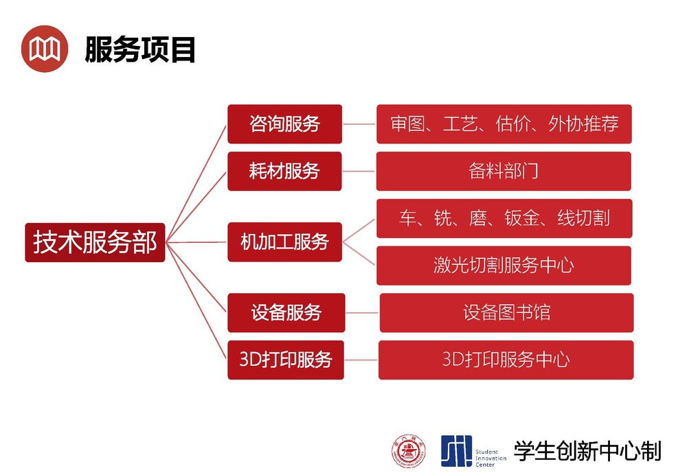

# 常用场所

## **唐君远学生创新创业中心**

**上海交通大学唐君远学生创新创业中心（唐创）** 坐落在龙宾楼一楼，于 2023 年 4 月落成启用，由上海唐君远教育基金会参与捐建。中心以培育学生双创精神、双创能力为核心，融合课堂内外双创教育资源，连接学院内外双创育人渠道，凝聚校园内外双创育人合力，形成具有 GC 特色的全天候、递进式创新创业育人体系，助力培养国际化、领袖型、创新性的人才。

中心开设双创教育、创业辅修等系列课程，支持学院毕业设计、设计制造等系列专业课程，举办创新创业系列讲座和工作坊，指导工业大数据俱乐部等学生俱乐部，协同学院团委指导学生科协等学生组织，开展学院内外各类科创比赛的组织、指导等工作。

中心总建设面积超 1000 平方米，设有**3D 打印**、**机械加工**、**五轴加工**、**激光切割**、**电子电路设计**、**电子部件组装**、**VR/AR 虚拟实验室**等功能区域，为学生提供创新创业软硬件资源支撑。

## **俞黎明学生中心**

**俞黎明学生中心**位于龙宾楼三楼东翼，总面积约 860 平方米。这里不仅是一个学习空间，更是大家日常交流和成长的"舒适角落"。中心内设有学业指导中心、自习区、小组讨论室、机房、休闲区、图书角、和作品展示区。

无论是需要安静的自习环境，还是和小伙伴们的头脑风暴，这里都能满足。中心还提供一对一的学业指导，帮助同学们找到更适合自己的学习方法。希望同学们在这里既能高效学习，也能自在交流。

## **学生创新中心**

**学生创新中心（学创）** 位于四餐南侧。自建设以来，学创整合开放服务资源，抽调骨干力量成立了"学生技术服务推进组"，组建了"技术服务部门"，并指派两位技术过硬、经验丰富的老师专职负责"技术服务部门"的日程运行，接待广大同学的技术咨询、加工服务申请等事宜。对于需求量较大的"机加工"服务，学生只需参与服务流程中的第一步和最后一步即可，中间步骤全部由"技术服务团队"完成。

详情参考
[上海交通大学学生创新中心](https://www.si.sjtu.edu.cn/home)

### **设备图书馆**

**设备图书馆**位于学生创新中心 B 楼内侧（进门走到最里）。设备图书馆旨在让交大同学们能够像借阅图书一般借阅设备，包括各类配件。可前往[dev.si.sjtu.edu.cn](https://dev.si.sjtu.edu.cn/)进行申请借用，通常审核流程需要 1-2 日，设备需要在 1 个月内归还或续借（有些配件可能标注了无需归还）。

### **学创加工服务**

**链接：[https://make.sjtu.edu.cn/](https://make.sjtu.edu.cn/)**

目前提供了**3D 打印**和**激光切割**等加工服务。
